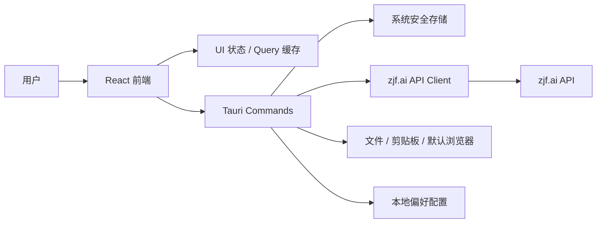
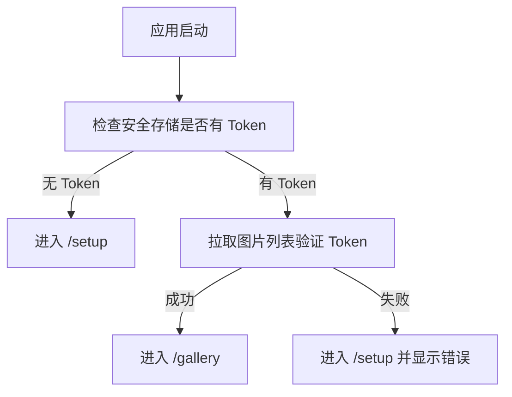
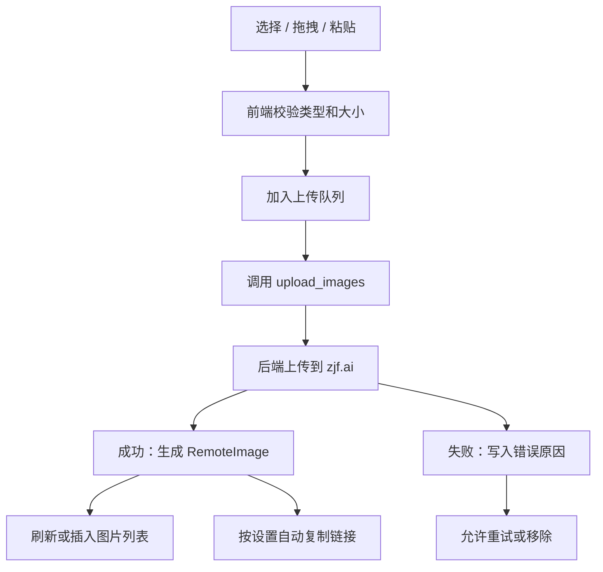

# ZJF Desktop 技术架构文档

## 1. 架构目标

ZJF Desktop 是一个跨平台桌面客户端。用户配置 zjf.ai API Token 后，可以在桌面端完成图片上传、图片列表管理、链接复制、删除图片和偏好设置。

技术架构需要满足以下目标：

- Token 安全：Token 不落明文配置文件，不进入前端日志和网络错误信息。
- 桌面体验：支持拖拽上传、粘贴上传、系统剪贴板、默认浏览器打开链接。
- API 稳定：统一封装 zjf.ai API，处理鉴权、错误码、超时、重试和返回字段兼容。
- 可扩展：后续可加入菜单栏上传、全局快捷键、缩略图缓存、多 Token、多账号、私有图能力。
- 轻量分发：优先控制安装包体积、启动速度和资源占用。

## 2. 推荐技术栈

### 2.1 桌面框架

推荐使用 Tauri 2。

选择理由：

- 安装包体积和运行内存通常低于 Electron。
- 原生能力通过 Rust 命令暴露给前端，适合处理 Token、安全存储、文件、剪贴板和网络请求。
- 前端仍然可以使用 React/Vite 快速开发原型和页面。
- 可通过 Rust 后端请求 zjf.ai API，避免纯 Web 前端可能遇到的 CORS 限制。

### 2.2 前端

- React
- TypeScript
- Vite
- Zustand 或 TanStack Query
- CSS Modules、Tailwind CSS 或普通 CSS 变量

首版推荐组合：

- React + TypeScript + Vite
- TanStack Query：管理远端图片列表、上传后刷新、删除后失效缓存。
- Zustand：管理本地 UI 状态，例如选中图片、上传队列、设置面板。

### 2.3 桌面后端

- Rust
- Tauri command
- reqwest：请求 zjf.ai API
- serde：请求和响应序列化
- tauri-plugin-store：保存非敏感偏好配置
- tauri-plugin-os / opener：打开外部链接
- 系统安全存储插件或 keyring crate：保存 Token

### 2.4 本地存储

- 系统安全存储：保存 API Token。
- Tauri Store 或本地 JSON：保存用户偏好。
- App cache 目录：后续保存缩略图缓存。

Token 不允许写入普通 JSON、localStorage、IndexedDB 或日志。

## 3. 总体架构



核心原则：

- 前端不直接保存 Token。
- 前端不直接拼接 Authorization 请求头。
- 所有 zjf.ai API 请求从 Tauri 后端发起。
- 前端只调用语义化命令，例如 `upload_images`、`list_images`、`delete_image`。

## 4. 应用模块划分

### 4.1 前端模块

建议目录：

```text
src/
  app/
    App.tsx
    routes.tsx
  pages/
    token-setup/
    gallery/
    image-detail/
    upload-queue/
    settings/
  components/
    app-shell/
    toolbar/
    image-grid/
    upload-dropzone/
    upload-queue/
    confirm-dialog/
    empty-state/
  stores/
    app-settings-store.ts
    upload-queue-store.ts
    selection-store.ts
  api/
    desktop-commands.ts
  types/
    image.ts
    upload.ts
    settings.ts
```

页面对应关系：

- `TokenSetupPage`：首次配置 Token。
- `GalleryPage`：图片列表、搜索、拖拽上传入口。
- `ImageDetailPage`：图片预览、复制链接、删除入口。
- `UploadQueuePage`：上传进度、失败重试、清除完成项。
- `SettingsPage`：Token 管理、复制格式、自动复制、缓存清理。
- `EmptyState` / `ErrorState`：空列表、Token 失效、网络异常。

### 4.2 Tauri 后端模块

建议目录：

```text
src-tauri/src/
  main.rs
  commands/
    auth.rs
    images.rs
    uploads.rs
    settings.rs
    clipboard.rs
  services/
    zjf_api.rs
    token_store.rs
    settings_store.rs
    file_service.rs
  models/
    image.rs
    upload.rs
    error.rs
```

职责划分：

- `commands/auth.rs`：Token 保存、读取状态、验证、清除。
- `commands/images.rs`：图片列表、图片删除。
- `commands/uploads.rs`：文件上传、粘贴上传、批量上传任务。
- `commands/settings.rs`：读写偏好配置。
- `commands/clipboard.rs`：写入 URL、Markdown、HTML 到剪贴板。
- `services/zjf_api.rs`：统一封装 zjf.ai API。
- `services/token_store.rs`：系统安全存储读写。
- `services/settings_store.rs`：非敏感配置读写。

## 5. 核心数据模型

### 5.1 图片模型

```ts
type RemoteImage = {
  id: string;
  fileName: string;
  url: string;
  thumbnailUrl?: string;
  width?: number;
  height?: number;
  sizeBytes?: number;
  mimeType?: string;
  visibility?: "public" | "private" | "unknown";
  createdAt?: string;
};
```

实际字段需要根据 zjf.ai API 返回结果做适配。前端只依赖应用内部模型，不直接依赖原始 API 返回结构。

### 5.2 上传任务模型

```ts
type UploadTask = {
  id: string;
  fileName: string;
  sizeBytes: number;
  status: "queued" | "uploading" | "success" | "failed";
  progress: number;
  image?: RemoteImage;
  errorMessage?: string;
};
```

### 5.3 用户设置模型

```ts
type AppSettings = {
  defaultCopyFormat: "url" | "markdown" | "html";
  autoCopyAfterUpload: boolean;
  thumbnailCacheEnabled: boolean;
};
```

## 6. API 封装

MVP 依赖以下 zjf.ai API：

- 上传图片：`POST /api/upload`
- 获取图片列表：`GET /api/uploads?pageSize=100`
- 删除图片：`DELETE /api/uploads/:id`

所有请求由后端统一添加：

```http
Authorization: Bearer <token>
```

建议封装为：

```rust
pub struct ZjfApiClient {
    base_url: String,
    http: reqwest::Client,
}

impl ZjfApiClient {
    pub async fn validate_token(&self, token: &str) -> Result<(), AppError>;
    pub async fn list_images(&self, token: &str) -> Result<Vec<RemoteImage>, AppError>;
    pub async fn upload_image(&self, token: &str, file: UploadFile) -> Result<RemoteImage, AppError>;
    pub async fn delete_image(&self, token: &str, image_id: &str) -> Result<(), AppError>;
}
```

API 适配层需要处理：

- HTTP 401 / 403：Token 无效或权限不足。
- HTTP 413：文件过大。
- HTTP 415：文件类型不支持。
- 5xx：服务端异常。
- 网络超时：提示用户重试。
- 返回字段缺失：使用内部默认值兜底。

## 7. Token 安全设计

Token 生命周期：

1. 用户在 Token 配置页输入 Token。
2. 前端调用 `validate_token(token)`。
3. 后端使用 Token 请求 `GET /api/uploads?pageSize=100` 或专用校验接口。
4. 验证成功后，后端写入系统安全存储。
5. 前端只保存 `hasToken: true` 和脱敏后的 Token 展示值。
6. 后续 API 请求由后端从安全存储读取 Token。

安全要求：

- 前端状态不长期保存完整 Token。
- Token 不写入 localStorage、IndexedDB、普通 JSON。
- 日志输出前做脱敏。
- 错误对象不包含 Authorization 头。
- 清除 Token 时同步清理 Query 缓存和上传队列。

脱敏格式：

```text
zjf_••••••••••8Q2K
```

## 8. 页面与路由架构

建议使用本地路由：

```text
/setup
/gallery
/images/:id
/uploads
/settings
```

启动路由判断：



页面职责：

- `/setup`：只负责 Token 输入、验证和保存。
- `/gallery`：负责列表、搜索、上传入口、批量选择。
- `/images/:id`：负责详情、复制格式、删除入口。
- `/uploads`：负责上传队列和失败重试。
- `/settings`：负责偏好配置和 Token 管理。

## 9. 上传架构

上传来源：

- 文件选择。
- 拖拽文件。
- 剪贴板图片。

上传流程：



建议策略：

- MVP 可先串行上传，降低速率限制和错误处理复杂度。
- 上传任务状态保存在前端 Zustand store。
- 单个任务失败不阻塞其他任务。
- 上传成功后优先将返回图片插入列表顶部，再后台刷新列表校准远端状态。

## 10. 图片列表与缓存

MVP：

- 使用 TanStack Query 缓存 `listImages`。
- 搜索在前端本地完成。
- 删除成功后从缓存中移除对应图片。
- 上传成功后插入缓存顶部。

后续：

- 支持分页和远端搜索。
- 支持缩略图落盘缓存。
- 支持离线查看最近图片元数据。

缓存键建议：

```ts
["images", { tokenProfile: "default" }]
```

不要把 Token 放进缓存键。

## 11. 剪贴板与复制格式

复制格式由前端生成或后端生成均可。推荐前端根据 `RemoteImage` 生成展示文本，后端只负责写剪贴板。

```ts
function formatImageLink(image: RemoteImage, format: CopyFormat) {
  if (format === "url") return image.url;
  if (format === "markdown") return ``;
  return ``;
}
```

注意：

- 文件名用于 HTML 时需要转义。
- URL 缺失时禁用复制按钮。
- 复制成功后展示 toast。

## 12. 错误处理

统一错误模型：

```ts
type AppError = {
  code:
    | "TOKEN_INVALID"
    | "NETWORK_ERROR"
    | "FILE_TOO_LARGE"
    | "UNSUPPORTED_FILE_TYPE"
    | "API_ERROR"
    | "UNKNOWN";
  message: string;
  retryable: boolean;
};
```

错误展示规则：

- Token 无效：回到 Token 配置页或弹出重新配置入口。
- 网络失败：列表页展示重试按钮。
- 上传失败：保留在上传队列，展示失败原因和重试按钮。
- 删除失败：保持图片不变，展示 toast 或弹窗。
- 未知错误：给出通用提示，不暴露内部堆栈。

## 13. 日志与观测

MVP 可使用本地日志：

- 应用启动。
- Token 验证成功或失败，不记录 Token 原文。
- 图片列表拉取成功或失败。
- 上传任务成功或失败。
- 删除操作成功或失败。

日志脱敏规则：

- 删除 `Authorization` 请求头。
- Token 字符串只保留前缀和后四位。
- 文件本地路径如无必要不输出完整路径。

## 14. 构建与发布

建议阶段：

1. 本地开发：Vite + Tauri dev。
2. 内测构建：macOS dmg / Windows msi / Linux AppImage。
3. 版本签名：macOS notarization、Windows code signing。
4. 自动更新：后续接入 Tauri updater。

首版可以先支持 macOS，再扩展 Windows 和 Linux。

## 15. 测试策略

### 15.1 单元测试

- 链接格式化。
- API 响应适配。
- 错误码映射。
- Token 脱敏。
- 上传任务状态流转。

### 15.2 集成测试

- Token 验证成功和失败。
- 图片列表拉取。
- 上传成功、上传失败。
- 删除成功、删除失败。

### 15.3 手动验收

- 首次启动无 Token 进入配置页。
- 保存 Token 后重启仍能进入图库。
- 拖拽上传、粘贴上传、文件选择上传均可用。
- 上传成功后自动复制符合设置。
- 删除前必须二次确认。
- 日志中搜不到 Token 原文。

## 16. 开发里程碑

### 阶段 1：项目骨架

- 初始化 Tauri + React + TypeScript。
- 建立页面路由和 AppShell。
- 迁移原型样式到组件。

### 阶段 2：Token 与 API

- 实现系统安全存储。
- 实现 Token 验证。
- 实现 zjf.ai API Client。
- 完成 Token 配置页。

### 阶段 3：图库管理

- 实现图片列表。
- 实现本地搜索。
- 实现图片详情页。
- 实现复制 URL、Markdown、HTML。

### 阶段 4：上传与删除

- 实现文件选择上传。
- 实现拖拽上传。
- 实现粘贴上传。
- 实现上传队列。
- 实现删除确认和远端删除。

### 阶段 5：设置与收尾

- 实现复制格式偏好。
- 实现自动复制配置。
- 实现清除 Token。
- 完善错误状态、空状态、日志脱敏。

## 17. 风险与应对

- API 字段不稳定：使用 `zjf_api` 适配层隔离原始响应。
- API 不支持分页：MVP 做全量列表，本地搜索；后续根据 API 能力升级。
- 私有图片 Signed URL 不能通过 API 获取：首版只展示私有状态，不承诺 Signed URL 管理。
- 批量上传触发速率限制：首版串行上传，后续再做并发数配置。
- 跨平台安全存储差异：封装 `TokenStore` trait，平台差异留在后端实现里。
- 剪贴板权限差异：复制动作统一从 Tauri 后端处理，并在失败时给出手动复制兜底。

## 18. 推荐首版边界

首版必须做：

- Token 配置、验证、安全存储。
- 图片列表、刷新、本地搜索。
- 图片上传：选择文件、拖拽、粘贴。
- 上传队列：成功、失败、重试、清除完成。
- 复制 URL、Markdown、HTML。
- 删除图片和二次确认。
- 设置页：复制格式、自动复制、清除 Token。

首版暂不做：

- 多账号。
- 文件夹和标签。
- 全局快捷键。
- 菜单栏上传。
- 私有图片 Signed URL。
- 上传前压缩和格式转换。
